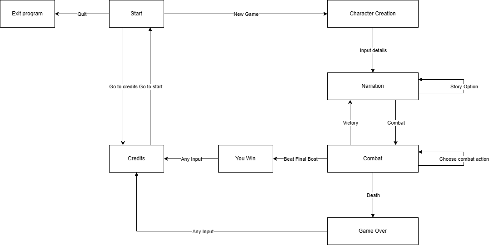
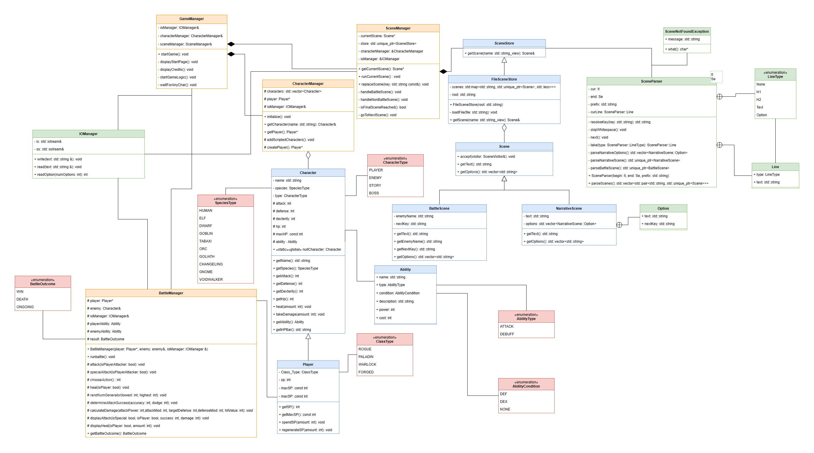
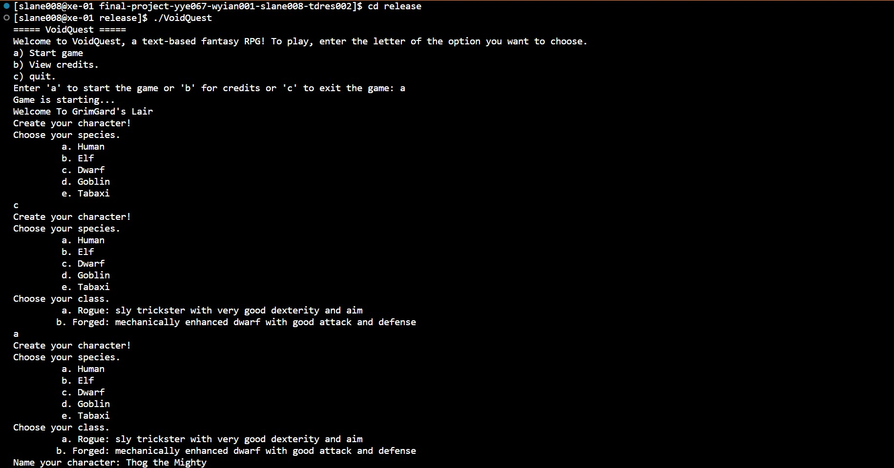
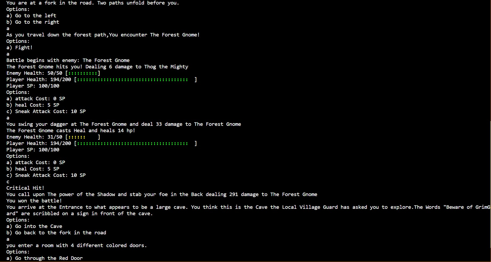
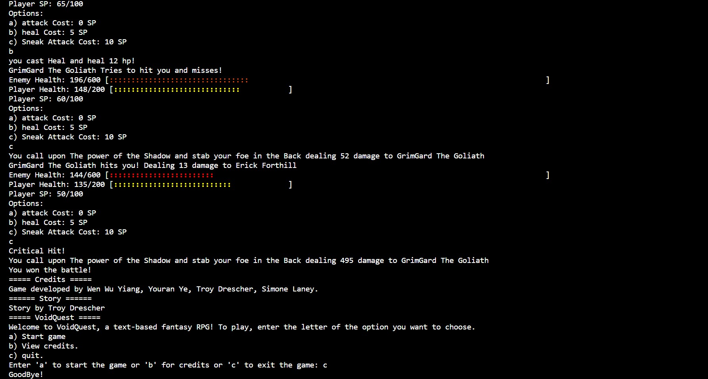
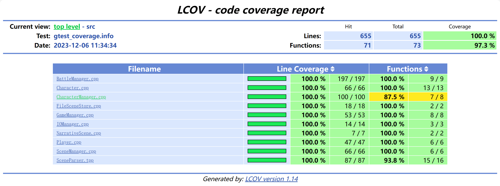

# Void Quest
 
Authors: [Wen Wu Yiang](https://github.com/W2YUCR), [Youran Ye](https://github.com/youranye), [Troy Drescher](https://github.com/KingElrond), [Simone Laney](https://github.com/simone07734)

## Project Description

Void Quest is a text based RPG written in C++ that takes place in the Stitch, a world bustling with Humans, Orcs, Elves, Dwarves, Goblins, and Giants. In this game, the player explores GrimGard's Lair, a winding cave system full of hidden dangers.

Features of our RPG:

* Character customization: Players can customize their character by choosing their name, species, and class, which affects their character stats and abilities.
* Extendible world: The world is set up using data files, which means that new content can be added by simply adding more files.
* Player choice: The player's choices affect their movement through the cave system.
* Combat system: Players are able to fight enemies throughout their journey, and upgrade their equipment.

Output: Scenes are text-based, and printed out to the console. It shows the narrative text, status such as health, and options for progression.
Input: Each option shown is lettered a, b, c, etc.. Users can select one of the options shown by typing the corresponding letter. 

This project interests us because we all are interested in designing and building a game. Some of our group members have played tabletop RPGs and enjoy the fantasy genre.

## User Interface Specification

### Navigation Diagram

This diagram shows a flowchart of the various parts of the program, starting from creating a character to progressing the story, combat, and the end of the game.

### Screen Layouts

Screens will contain text that relates to the story of the game. They will give the user a list of lettered options and prompt the user to select the letter of the option they desire. The user will select an option by typing the corresponding letter into the terminal and hitting enter. The expected input is one of the listed letters. In the case of character creation, a string is expected for the character's name. The game will include the following screens:
* Home/Start: Displays the title of the game. The user enters ‘a’ to start the game, ‘b’ to see the credits, or 'c' to quit.
* Credits: Displays the credits. The user enters any letter to return to the home/start screen.
* Story: Narrates a scene in the story. Explains a scenario to the user and asks them to choose what they will do next. Displays a list of options, each labeled with a letter. The user inputs the letter of the option they wish to choose.
* Game over: Displays a message that the player character has died and the credits. The user enters any letter to return to the home/start screen.
* Win: Displays a message the user has won the game and the credits. The user enters any letter to return to the home/start screen.

## Class Diagram

 

This Diagram describes the planned layout of our Project, GameManager is a class that manages the Game, it handles the story and connecting the backend of the game with the frontend. The Character Class is what stores character information and stats. ClassType and SpeciesType are enumerations. The CharacterManager Class stores and manages the characters. Scene is the Abstract Base Class for storing Text options and prompts. SceneStore stores these Scenes and SceneManager manages them. BattleManager manages battles and fights. It handles damage calculations, battle menus, everything related to battles. IOManager handles UserInput and verifying that it is valid before passing to other classes and parts of the program.
 
## Phase III

* What principles did you apply?
  
We applied the single responsibility principle to our GameManager class. GameManager violates Single Responsibility, since it coordinates between the SceneManager, BattleManager, and CharacterManager and also coordinates how to treat Battle and Narrative scenes. It should not implement any logic related to scenes.

* How did you apply it?
  
To fix it, we will add a runScene function to SceneManager. The runScene function will treat a scene differently depending on what type of scene it is. SceneManager will handle the logic of running the scene in the runScene function.

* How did this help us write better code? 
  
Now, the game will run independently of the specific implementation details of Scene. Any changes to the way scenes are run will not require us to refactor GameManager.

* What principles did you apply?

We applied the Liskov substitution principle to our classes that inherit from others. Our code does not violate this principle. Any call to a Character object would also resolve normally if the Character were replaced with a Player object (Player is a child of character). For Scene, calls to Scene would still function even if Scene was replaced with BattleScene or NarrativeScene. Both children have implementations to perform the function that the parent Scene would perform.

* Describe the change

Our code already fits the principle so no changes are needed.

* How did this help us write better code?

This improves our code by making sure any call made to a parent object will work even if the object is a child of the parent.

* What principles did you apply?

We applied interface segregation principle to our Character class. Our player character had features that our other characters didn’t. If we had implemented player functionality in Character, we would have violated interface segregation because Character would have had definitions of functions that it was unable to use because they were not applicable to all Characters.

* How did you apply it?

This change was from our original UML diagram to the current one. It has already been implemented. The solution was to add a Player class that inherits from Character and holds any members that would be specific to a player Character.

* How did this change help you write better code?

When there was only a Character class, it forced every character to share all methods and fields. Now that there is a player class, Character objects will not have methods they cannot even use.

* What principles did you apply?

We applied the dependency inversion principle to our SceneStore class. If SceneStore was not virtual, then it would depend on the way we format our scenes currently. If we ever changed the way we format scenes or added a new format, we would have to modify SceneStore.

* How did you apply it?

We implemented this design change during the second sprint. The getScene function in SceneStore is pure virtual, and is implemented by subclasses implementing the SceneStore interface. We added FileSceneStore, which inherits from SceneStore. If there was no FileSceneStore, then SceneStore would depend on a concretion, namely the exact format of file we are getting the scene from. FileSceneStore handles the exact loading of this type of scene by calling the parser.

* How did this change help you write better code?

If there was no SceneStore, SceneManager would rely on the FileSceneStore, which would tie it to a specific storage representation of the Scenes, and it would be difficult to stub/mock for testing. With SceneStore, SceneManager does not rely on any specific implementation for getting scenes. If we ever have a new format of scene that we would want to get, we would not have to modify SceneStore. We would only have to add a child of SceneStore with implementation details specific to that scene.

## New Class Diagram

 
 > ## Final deliverable
 > All group members will give a demo to the reader during lab time. ou should schedule your demo on Calendly with the same reader who took your second scrum meeting. The reader will check the demo and the project GitHub repository and ask a few questions to all the team members. 
 > Before the demo, you should do the following:
 > * Complete the sections below (i.e. Screenshots, Installation/Usage, Testing)
 > * Plan one more sprint (that you will not necessarily complete before the end of the quarter). Your In-progress and In-testing columns should be empty (you are not doing more work currently) but your TODO column should have a full sprint plan in it as you have done before. This should include any known bugs (there should be some) or new features you would like to add. These should appear as issues/cards on your Project board.
 > * Make sure your README file and Project board are up-to-date reflecting the current status of your project (e.g. any changes that you have made during the project such as changes to your class diagram). Previous versions should still be visible through your commit history. 
 
 ## Screenshots
 It would be impractical to include screenshots of every scene in the game. Here is a screenshot of the start of a game, including the creation of a character, choices for the player to make, and a battle.
 
 

 Here is a screenshot of the end of a game, including the credits and the option to quit or start a new game.
 
 
 ## Installation/Usage
 > Instructions on installing and running your application
 ## Testing
 ### Building, running tests, and evaluating test coverage
* Ensure that `--coverage` (or equivalently, `-fprofile-arcs -ftest-coverage`) is passed to CMAKE_CXX_FLAGS. For instance, include `-DCMAKE_CXX_FLAGS=”--coverage”` when running the cmake configuration command.
* Build the project and run the runAllTests executable (located in the bin subdirectory of the build directory)
     * Ensure all tests pass
     * Valgrind runAllTests with `leak-check=full` to ensure no leaks occur
* lcov the build directory and output into gtest_coverage.info (ignored by gitignore)
* genhtml, outputting into a CODE_COVERAGE directory (ignored by gitignore)

The VoidQuest executable has been manually run with valgrind to ensure no leaks occur in the final product.

We reached 100% code coverage with our tests.

### Exceptions to testing
Some non-deterministic functions have been excluded from testing due to tests not being able to be reproducible. This specifically affects the attack and specialAttack functions in BattleManager. The outcomes of these functions rely on multiple randomly generated numbers. The behavior of these functions has been verified by other tests that call these functions and by thorough playtesting. In the future, we could test these by providing an interface to generate random numbers which would be passed into classes requiring randomness, allowing us to deterministically mock the random interface.

 
