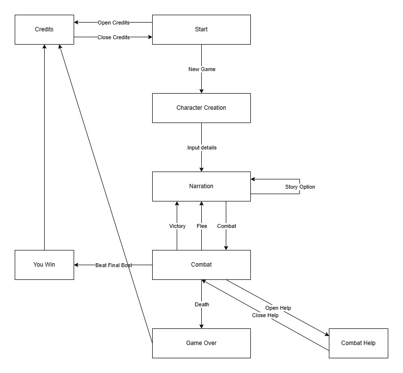

# Void Quest
 
Authors: [Wen Wu Yiang](https://github.com/W2YUCR), [Youran Ye](https://github.com/youranye), [Troy Drescher](https://github.com/KingElrond), [Simone Laney](https://github.com/simone07734)

## Project Description

Void Quest is a text based RPG written in C++ that takes place in the Stitch, a world bustling with Humans, Orcs, Elves, Dwarves, Goblins, and Giants.

In our RPG, you will be able to:
* Build a character by choosing their name, attributes, and Class
* Affect the story through your actions
* Fight enemies
* Explore the many areas of The Stitch
* Interact with NPCs

Scenes are text-based, and printed out to the console. In each scene, lettered options are displayed to the user, who can select one by typing the corresponding letter. 

This project interests us because we all are interested in designing and building a game. Some of our group members have played tabletop RPGs and enjoy the fantasy genre.

 > ## Phase II
 > In addition to completing the "User Interface Specification" and "Class Diagram" sections below, you will need to:
 > * Create an "Epic" (note) for each feature. Place these epics in the `Product Backlog` column
 > * Complete your first *sprint planning* meeting to plan out the next 7 days of work.
 >   * Break down the "Epics" into smaller actionable user stories (i.e. smaller development tasks). Convert them into issues and assign them to team members. Place these in the `TODO` (aka Sprint Backlog) column.
 >   * These cards should represent roughly 7 days worth of development time for your team. Then, once the sprint is over you should be repeating these steps to plan a new sprint, taking you until your second scrum meeting with the reader in phase III.
 > * Schedule two check-ins using Calendly. You need to pick both time slots on Tuesday of week 6. The check-ins will occur on Zoom. Your entire team must be present for both check-ins.
 >   * The first check-in needs to be scheduled with your lab TA. During that meeting, you will discuss your project design/class diagram from phase II.
 >   * The second check-in should be scheduled with a reader. During that meeting you will discuss:
 >     * The tasks you are planning for the first sprint
 >     * How work will be divided between the team members
## User Interface Specification

### Navigation Diagram

This diagram shows a flowchart of the various parts of the program, starting from creating a character to progressing the story, combat, and the end of the game.

### Screen Layouts

Screens will contain text that relates to the story of the game. They will give the user a list of lettered options and prompt the user to select the letter of the option they desire. The user will select an option by typing the corresponding letter into the terminal and hitting enter. The expected input is one of the listed letters. In the case of character creation, a string is expected for the character's name. The game will include the following screens:
* Home/Start: Displays the title of the game. The user enters ‘a’ to start the game or ‘b’ to see the credits.
* Credits: Displays the credits. The user enters any letter to return to the home/start screen.
* Story: Narrates a scene in the story. Explains a scenario to the user and asks them to choose what they will do next. Displays a list of options, each labeled with a letter. The user inputs the letter of the option they wish to choose.
* Combat help: Displays an explanation of combat mechanics. The user enters any letter to return to the story.
* Game over: Displays a message that the player character has died. The user enters any letter to return to the home/start screen.
* Win: Displays a message the user has won the game. The user enters any letter to return to the home/start screen.

## Class Diagram

 

This Diagram describes the planned layout of our Project, GameManager is a class that manages the Game, it handles the story and connecting the backend of the game with the frontend. The Character Class is what stores character information and stats, ClassType and SpeciesType are enumerations, The CharacterManager Class stores and manages the characters. Scene is the Abstract Base Class for storing Text options and prompts. SceneStore Stores and Manages these Scenes. BattleManager manages battles and fights. Handles damage calculations, battle menus, everything related to battles. IOManager handles UserInput and verifying that it is valid before passing to other classes and parts of the program.
 
 > ## Phase III
 > You will need to schedule a check-in for the second scrum meeting with the same reader you had your first scrum meeting with (using Calendly). Your entire team must be present. This meeting will occur on Zoom and should be conducted by Wednesday of week 8.
 
 > BEFORE the meeting you should do the following:
 > * Update your class diagram from Phase II to include any feedback you received from your TA/grader.
 > * Considering the SOLID design principles, reflect back on your class diagram and think about how you can use the SOLID principles to improve your design. You should then update the README.md file by adding the following:
 >   * A new class diagram incorporating your changes after considering the SOLID principles.
 >   * For each update in your class diagram, you must explain in 3-4 sentences:
 >     * What SOLID principle(s) did you apply?
 >     * How did you apply it? i.e. describe the change.
 >     * How did this change help you write better code?
 > * Perform a new sprint plan like you did in Phase II.
 > * You should also make sure that your README file (and Project board) are up-to-date reflecting the current status of your project and the most recent class diagram. Previous versions of the README file should still be visible through your commit history.
 
> During the meeting with your reader you will discuss: 
 > * How effective your last sprint was (each member should talk about what they did)
 > * Any tasks that did not get completed last sprint, and how you took them into consideration for this sprint
 > * Any bugs you've identified and created issues for during the sprint. Do you plan on fixing them in the next sprint or are they lower priority?
 > * What tasks you are planning for this next sprint.

 
 > ## Final deliverable
 > All group members will give a demo to the reader during lab time. ou should schedule your demo on Calendly with the same reader who took your second scrum meeting. The reader will check the demo and the project GitHub repository and ask a few questions to all the team members. 
 > Before the demo, you should do the following:
 > * Complete the sections below (i.e. Screenshots, Installation/Usage, Testing)
 > * Plan one more sprint (that you will not necessarily complete before the end of the quarter). Your In-progress and In-testing columns should be empty (you are not doing more work currently) but your TODO column should have a full sprint plan in it as you have done before. This should include any known bugs (there should be some) or new features you would like to add. These should appear as issues/cards on your Project board.
 > * Make sure your README file and Project board are up-to-date reflecting the current status of your project (e.g. any changes that you have made during the project such as changes to your class diagram). Previous versions should still be visible through your commit history. 
 
 ## Screenshots
 > Screenshots of the input/output after running your application
 ## Installation/Usage
 > Instructions on installing and running your application
 ## Testing
 > How was your project tested/validated? If you used CI, you should have a "build passing" badge in this README.
 
